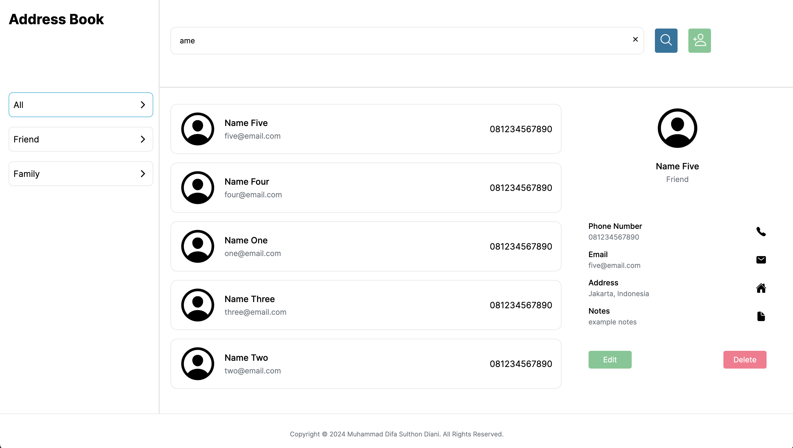

# Address Book

This repository for Address Book web app. Address Book is an application that can be used for contact management based on **HTML**, **CSS**, and **Javascript** technologies. The Address Book contains several features that can be used by users. Here are some of the features in this Address Book Web App.

- **Contact List**: Display a list of contacts with their names and essential details.
- **Contact Details**: Clicking on a contact should show a content displaying detailed information, including phone numbers, email addresses, and any additional notes.
- **Add New Contact**: Provide a form or interface to add new contacts with fields for name, phone number, email, address, and notes.
- **Delete and Edit Contact**: Allow users to delete and edit existing contact information.
- **Search Functionality**: Implement a search bar to quickly find contacts by name.
- **Categories**: Enable users to categorize contacts into categories (e.g., Friends, Family).

This is an example of user interface this website.

